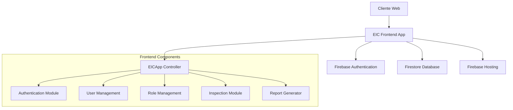
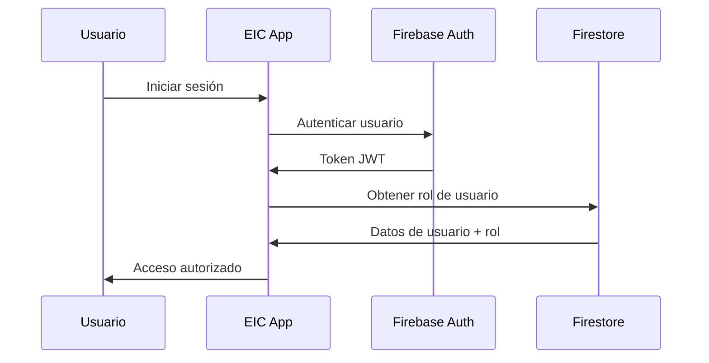

# Arquitectura del Sistema EIC Inspection App

## 📋 Visión General

La aplicación EIC (Establishment Inspection Checklist) es una aplicación web progresiva diseñada para gestionar inspecciones de seguridad alimentaria. Utiliza una arquitectura moderna basada en componentes con Firebase como backend.

## 🏗️ Arquitectura de Alto Nivel



## 🔧 Componentes del Sistema

### 1. Frontend Application (SPA)

#### EICApp (Controlador Principal)
```javascript
class EICApp {
  constructor() {
    this.currentUser = null;
    this.currentUserRole = null;
    this.currentView = 'login';
    this.reports = [];
    this.users = [];
    // ... más propiedades
  }
}
```

**Responsabilidades:**
- Gestión del estado global de la aplicación
- Enrutamiento entre vistas
- Coordinación de módulos
- Manejo de eventos de autenticación

#### Módulos Especializados

##### Authentication Module (auth.js)
- Integración con Firebase Auth
- Login con Google OAuth
- Login con email/password
- Gestión de sesiones

##### User Management Module (user-management.js)
- CRUD de usuarios
- Asignación de roles
- Validación de permisos
- Interfaz de administración

##### Role Management Module (role-management.js)
- Definición de roles: inspector, admin, superadmin
- Control de acceso basado en roles (RBAC)
- Validación de permisos por funcionalidad

### 2. Backend Services (Firebase)

#### Firebase Authentication
- Proveedores: Google OAuth, Email/Password
- Gestión de tokens JWT
- Integración con Firestore para roles

#### Firestore Database
```
Collections:
├── users/
│   ├── {userId}/
│   │   ├── email: string
│   │   ├── role: string
│   │   ├── createdAt: timestamp
│   │   └── lastLogin: timestamp
├── inspections/
│   ├── {inspectionId}/
│   │   ├── establishmentName: string
│   │   ├── inspectorId: string
│   │   ├── date: timestamp
│   │   ├── status: string
│   │   └── checklist: object
└── reports/
    ├── {reportId}/
    │   ├── inspectionId: string
    │   ├── generatedBy: string
    │   ├── createdAt: timestamp
    │   └── data: object
```

## 🔐 Seguridad y Autenticación

### Flujo de Autenticación


### Roles y Permisos

#### Inspector
- Crear y editar inspecciones propias
- Ver reportes propios
- Acceso limitado al dashboard

#### Admin
- Todas las funciones de Inspector
- Gestionar usuarios (crear, editar, desactivar)
- Ver todas las inspecciones
- Generar reportes globales
- Acceso completo al dashboard

#### Superadmin
- Todas las funciones de Admin
- Gestionar roles de usuarios
- Configuración del sistema
- Acceso a logs y métricas

### Reglas de Seguridad Firestore
```javascript
rules_version = '2';
service cloud.firestore {
  match /databases/{database}/documents {
    // Usuarios solo pueden leer/escribir sus propios datos
    match /users/{userId} {
      allow read, write: if request.auth != null && request.auth.uid == userId;
    }
    
    // Inspecciones: inspectores ven las suyas, admins ven todas
    match /inspections/{inspectionId} {
      allow read, write: if request.auth != null && 
        (resource.data.inspectorId == request.auth.uid || 
         get(/databases/$(database)/documents/users/$(request.auth.uid)).data.role in ['admin', 'superadmin']);
    }
  }
}
```

## 📱 Interfaz de Usuario

### Tecnologías Frontend
- **HTML5:** Estructura semántica
- **CSS3 + Tailwind CSS:** Estilos responsivos
- **JavaScript ES6+:** Lógica de aplicación
- **SweetAlert2:** Notificaciones y modales

### Responsive Design
```css
/* Mobile First Approach */
.container {
  @apply px-4 mx-auto;
}

@screen sm {
  .container { @apply px-6; }
}

@screen lg {
  .container { @apply px-8 max-w-7xl; }
}
```

### Vistas Principales

#### 1. Login View
- Formulario de autenticación
- Botón de Google OAuth
- Recuperación de contraseña

#### 2. Dashboard View (Admin/Superadmin)
- Métricas de inspecciones
- Gráficos de cumplimiento
- Lista de usuarios activos
- Reportes recientes

#### 3. Inspection View
- Formulario de checklist
- Carga de evidencias
- Guardado automático
- Validación en tiempo real

#### 4. Reports View
- Lista de reportes
- Filtros y búsqueda
- Exportación PDF/Excel
- Visualización de datos

#### 5. User Management View (Admin+)
- Tabla de usuarios
- Formularios CRUD
- Asignación de roles
- Estados de cuenta

## 🔄 Flujo de Datos

### Patrón de Arquitectura
La aplicación sigue un patrón **MVC modificado** adaptado para SPA:

- **Model:** Datos en Firestore + estado local en EICApp
- **View:** Templates HTML dinámicos
- **Controller:** Métodos de EICApp + módulos especializados

### Gestión de Estado
```javascript
// Estado centralizado en EICApp
class EICApp {
  // Estado de autenticación
  currentUser = null;
  currentUserRole = null;
  
  // Estado de datos
  reports = [];
  users = [];
  inspections = [];
  
  // Estado de UI
  currentView = 'login';
  loading = false;
  
  // Métodos para actualizar estado
  setState(newState) {
    Object.assign(this, newState);
    this.render();
  }
}
```

### Sincronización con Firebase
```javascript
// Listeners en tiempo real
onAuthStateChanged(auth, (user) => {
  if (user) {
    this.currentUser = user;
    this.fetchUserRole();
    this.setupRealtimeListeners();
  }
});

// Listeners de Firestore
onSnapshot(collection(db, 'inspections'), (snapshot) => {
  this.reports = snapshot.docs.map(doc => ({
    id: doc.id,
    ...doc.data()
  }));
  this.render();
});
```

## 🚀 Rendimiento y Optimización

### Estrategias de Optimización

#### 1. Lazy Loading
```javascript
// Carga diferida de módulos
async loadModule(moduleName) {
  const module = await import(`./modules/${moduleName}.js`);
  return module.default;
}
```

#### 2. Caché Local
```javascript
// Cache de datos frecuentemente accedidos
class DataCache {
  constructor() {
    this.cache = new Map();
    this.ttl = 5 * 60 * 1000; // 5 minutos
  }
  
  set(key, data) {
    this.cache.set(key, {
      data,
      timestamp: Date.now()
    });
  }
  
  get(key) {
    const item = this.cache.get(key);
    if (!item) return null;
    
    if (Date.now() - item.timestamp > this.ttl) {
      this.cache.delete(key);
      return null;
    }
    
    return item.data;
  }
}
```

#### 3. Paginación
```javascript
// Paginación de listas grandes
async fetchReports(page = 1, limit = 20) {
  const q = query(
    collection(db, 'inspections'),
    orderBy('date', 'desc'),
    limit(limit),
    startAfter(this.lastVisible)
  );
  
  const snapshot = await getDocs(q);
  this.lastVisible = snapshot.docs[snapshot.docs.length - 1];
  
  return snapshot.docs.map(doc => ({
    id: doc.id,
    ...doc.data()
  }));
}
```

### Métricas de Rendimiento
- **First Contentful Paint:** < 2s
- **Largest Contentful Paint:** < 3s
- **Time to Interactive:** < 4s
- **Cumulative Layout Shift:** < 0.1

## 🔧 Desarrollo y Mantenimiento

### Estructura de Desarrollo
```
src/
├── js/
│   ├── app.js              # Controlador principal
│   ├── auth.js             # Módulo de autenticación
│   ├── firebase-config.js  # Configuración Firebase
│   ├── modules/            # Módulos especializados
│   │   ├── user-management.js
│   │   ├── role-management.js
│   │   └── inspection-manager.js
│   └── utils/              # Utilidades
│       ├── validator.js
│       ├── logger.js
│       └── constants.js
├── css/
│   ├── styles.css          # Estilos principales
│   ├── components/         # Estilos por componente
│   └── utilities/          # Utilidades CSS
└── assets/
    ├── images/
    └── icons/
```

### Patrones de Código

#### 1. Module Pattern
```javascript
// Módulo autocontenido
const InspectionManager = (() => {
  // Variables privadas
  let inspections = [];
  
  // Métodos privados
  function validateInspection(data) {
    // Validación
  }
  
  // API pública
  return {
    create: (data) => {
      if (!validateInspection(data)) return false;
      // Crear inspección
    },
    
    update: (id, data) => {
      // Actualizar inspección
    },
    
    delete: (id) => {
      // Eliminar inspección
    }
  };
})();
```

#### 2. Observer Pattern
```javascript
// Sistema de eventos
class EventEmitter {
  constructor() {
    this.events = {};
  }
  
  on(event, callback) {
    if (!this.events[event]) {
      this.events[event] = [];
    }
    this.events[event].push(callback);
  }
  
  emit(event, data) {
    if (this.events[event]) {
      this.events[event].forEach(callback => callback(data));
    }
  }
}
```

## 📊 Monitoreo y Analytics

### Métricas de Negocio
- Número de inspecciones por día/semana/mes
- Tiempo promedio de completar una inspección
- Tasa de cumplimiento por establecimiento
- Usuarios activos por rol

### Métricas Técnicas
- Tiempo de respuesta de la aplicación
- Errores de JavaScript
- Uso de Firebase (lecturas/escrituras)
- Rendimiento de consultas

### Implementación de Analytics
```javascript
// Google Analytics 4
gtag('config', 'GA_MEASUREMENT_ID', {
  custom_map: {
    'custom_parameter_1': 'user_role',
    'custom_parameter_2': 'inspection_type'
  }
});

// Eventos personalizados
function trackInspectionCreated(inspectionData) {
  gtag('event', 'inspection_created', {
    'custom_parameter_1': eicApp.currentUserRole,
    'custom_parameter_2': inspectionData.type,
    'value': 1
  });
}
```

## 🔮 Roadmap Técnico

### Próximas Mejoras

#### Corto Plazo (1-3 meses)
- [ ] Implementar Service Workers para PWA
- [ ] Añadir tests unitarios y de integración
- [ ] Optimizar bundle size con tree shaking
- [ ] Implementar error boundaries

#### Medio Plazo (3-6 meses)
- [ ] Migrar a TypeScript
- [ ] Implementar arquitectura de microfrontends
- [ ] Añadir soporte offline
- [ ] Integrar con APIs externas

#### Largo Plazo (6-12 meses)
- [ ] Migrar a framework moderno (React/Vue)
- [ ] Implementar GraphQL
- [ ] Añadir machine learning para predicciones
- [ ] Desarrollar app móvil nativa

---

*Documento de arquitectura v1.0*
*Última actualización: 30 de Junio, 2025*
